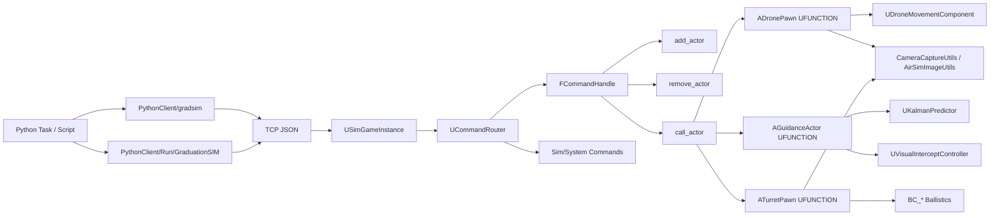

# 基于 Unreal Engine 5.7 的无人机拦截仿真平台

本项目是一个面向“低空目标感知、目标跟踪、无人机拦截、转台火控、图像采集与实验复现”的 UE5.7 + Python 联合仿真平台。当前代码主线已经从“专用命令处理器”切换为“通用 Actor 命令 + 反射调用”架构，Python 侧也整理为 `gradsim` 与 `GraduationSIM` 两层封装。

## 项目定位

当前仓库主要解决三件事：

1. 用 Unreal Engine 搭建一个可交互、可扩展、可动态生成智能体的仿真场景。
2. 用 Python 在场景外完成任务编排、视觉检测、实验控制和批量复现。
3. 把无人机控制、视觉拦截、卡尔曼预测、转台射击和数据记录串成一条完整实验链路。

## 当前代码主线

当前版本的主线不是旧文档中的 `DroneCommandHandler / GuidanceCommandHandler / TurretCommandHandler`，而是下面这条链路：



这条主线的核心变化有四点：

- `UCommandRouter` 现在主要负责系统命令和通用 actor 命令入口。
- `FCommandHandle` 负责 `add_actor / remove_actor / call_actor`，并通过 UE 反射直接调用 Actor 的 `UFUNCTION`。
- `AGuidanceActor` 成为制导中心，统一承载火控制导、目标预测、自动拦截和视觉拦截。
- Python 侧主力包已经变成 `PythonClient/gradsim`，`PythonClient/Run/GraduationSIM` 是进一步整理后的强类型任务层。

## 与旧版文档相比的关键差异

如果你之前看过仓库内旧文档，需要先修正下面几个认识：

- 旧文档把 `DroneCommandHandler / GuidanceCommandHandler / TurretCommandHandler` 当作主入口，但这些文件已经不是当前主路径，部分文件已经删除。
- 现在的远程调用方式不是“按模块专用命令分发”，而是“通过 `call_actor` 直接调用目标 Actor 暴露的 `UFUNCTION`”。
- 图像获取也不再依赖旧式单独协议包装，而是由 `ADronePawn::GetImage`、`ATurretPawn::GetImage` 直接返回 AirSim 风格 JSON。
- 当前视觉拦截主入口是 `PythonClient/Drone/auto_spawn_visual_intercept.py`，内部调用的是 `gradsim.run_visual_intercept(...)`。
- `PythonClient/Run/run.py` 是新的任务入口，底层使用 `GraduationSIM` 数据类、轨迹工厂和任务运行器。

## 当前目录结构

```text
GraduationProject/
├── Config/
├── Content/
├── Document/
│   ├── 项目实现流程与方法详解.md
│   └── 其他开发记录文档
├── PythonClient/
│   ├── gradsim/
│   │   ├── client.py
│   │   ├── AgentBase.py
│   │   ├── AgentDrone.py
│   │   ├── AgentGuidance.py
│   │   ├── AgentTurret.py
│   │   ├── MissionRuntime.py
│   │   ├── InterceptMission.py
│   │   ├── VisualIntercept.py
│   │   ├── VisionUtils.py
│   │   └── YoloDetector.py
│   ├── Drone/
│   │   └── auto_spawn_visual_intercept.py
│   ├── Run/
│   │   ├── run.py
│   │   └── GraduationSIM/
│   ├── Turret/
│   │   └── 兼容/历史脚本
│   └── YOLO/
├── Source/GraduationProject/
│   ├── Core/
│   │   ├── Network/
│   │   ├── Manager/
│   │   ├── Simulation/
│   │   └── Controller/
│   ├── Drone/
│   ├── Guidance/
│   ├── Turret/
│   ├── Vision/
│   └── UI/
├── GraduationProject.uproject
└── README.md
```

## UE 侧核心模块

### 1. `Core/Network`

- `USimGameInstance`：启动 TCP 服务端，监听 `127.0.0.1:9000`，负责收包、分帧、发响应。
- `UCommandRouter`：统一处理系统命令，例如 `ping`、`sim_pause`、`sim_resume`、`sim_reset`、`sim_step`、`get_agent_list`、`get_sensor_data`、录制命令等。
- `FCommandHandle`：处理通用 actor 命令。
  - `add_actor`：动态生成 Actor，自动分配 ID，必要时执行米到厘米转换。
  - `remove_actor`：销毁 Actor 并清理同一对象的所有别名注册。
  - `call_actor`：通过 UE 反射调用 `UFUNCTION`，支持 `bool/int/float/FString/FVector/FRotator/enum` 参数自动绑定。

### 2. `Core/Manager` 与 `Core/Simulation`

- `UAgentManager`：全局注册表，维护 `AgentId -> AActor*` 映射，是所有查找的基础设施。
- `UCommandExecutionManager`：异步命令生命周期记录器，支持状态查询和取消。
- `USimClockService`：仿真时钟、时间缩放和时间读取。
- `USensorManager`：从无人机状态生成 IMU/GPS/运动学 JSON。
- `USimulationRecorder`：把事件、状态和命令按 JSONL 记录到 `Saved/SimRecords`。
- `ASimGameMode`：仿真初始化、自动生成默认机体、暂停/恢复/重置。

### 3. `Drone`

- `ADronePawn`：无人机实体，对外暴露控制、状态和图像接口。
- `UDroneMovementComponent`：四旋翼动力学、级联控制器、控制分配矩阵、Velocity Verlet 积分。
- `UDroneApi`：高层控制包装。
- `FDroneParameters / FDroneState`：参数与状态容器。

### 4. `Guidance`

- `AGuidanceActor`：当前制导中心。
  - 火控制导：`SetMethod / UpdateTarget / ComputeAim / AutoEngage`
  - 机间拦截：`SetInterceptMethod / AutoIntercept`
  - 视觉拦截：`VisualInterceptStart / VisualInterceptUpdate / VisualInterceptStop / VisualInterceptState`
- `UKalmanPredictor`：9 维常加速度卡尔曼预测器。
- `GuidanceMethods`：直接瞄准、比例导航、预测制导。
- `UVisualInterceptController`：视觉状态机、PID、特征 Kalman 预测、搜索/跟踪/逼近/捕获逻辑。

### 5. `Turret`

- `ATurretPawn`：转台本体、图像输出、射击、预测线显示。
- `UTurretAiming`：目标跟踪与角度求解。
- `ABulletActor`：按预计算轨迹点驱动飞行。
- `BC_*`：拖曳模型、弹道积分、气象、风场、枪械参数与弹道点输出。

### 6. `Vision` 与 `UI`

- `CameraCaptureUtils`：创建 RenderTarget、JPEG/Base64 编码、AirSim 风格 JSON 打包。
- `AirSimImageUtils`：统一场景图、深度图、分割图、红外图采集。
- `ASimHUD / SimHUDPip`：HUD 文本、PIP 小窗、Agent 列表、快捷键切换。

## Python 侧两层封装

### 1. `PythonClient/gradsim`

这是当前最直接、最实用的一层。

- `client.py`：底层 TCP 客户端，维护连接、发送 JSON、解析响应。
- `AgentBase.py`：抽象出 `add_actor / remove_actor / call_actor`，并统一处理状态和图像返回值。
- `AgentDrone.py / AgentGuidance.py / AgentTurret.py`：分别对应 `ADronePawn / AGuidanceActor / ATurretPawn` 的调用包装。
- `MissionRuntime.py`：连接、清场、生成对象、起飞、清理的任务骨架。
- `InterceptMission.py`：目标圆轨迹、机载图像获取、YOLO 检测、视觉拦截控制、可视化循环。
- `VisualIntercept.py`：OpenCV 可视化窗口。
- `YoloDetector.py`：本地 Ultralytics 封装，并附带候选框筛选和阴影惩罚逻辑。

### 2. `PythonClient/Run/GraduationSIM`

这是更强类型、更结构化的任务层。

- 用 `DataTypes.py` 中的 dataclass 定义连接、无人机、轨迹、视觉和运行时配置。
- 用 `Trajectory.py` 生成目标轨迹，目前真正实现的是 `circle`，`line / waypoints / figure8` 仍是预留接口。
- 用 `Task.py` 组织完整任务生命周期。
- 用 `TCPClient.py / AgentBase.py / AgentDrone.py / AgentGuidance.py` 提供更规整的客户端封装。
- `run.py` 是面向命令行的正式入口。

## 当前通信模型

### 通用 actor 命令

```json
{
  "add_actor": {
    "classname": "/Game/Blueprints/BP_Drone.BP_Drone_C",
    "expected_id": "drone_0",
    "pose": {"x": 0.0, "y": 0.0, "z": 1.0, "roll": 0.0, "pitch": 0.0, "yaw": 0.0},
    "label": "Interceptor",
    "role": "interceptor",
    "unit": "m"
  }
}
```

```json
{
  "call_actor": {
    "actor_id": "drone_0",
    "function": "Takeoff",
    "return": false,
    "parameters": {
      "Altitude": 7.0
    }
  }
}
```

### 系统命令

当前仍由 `UCommandRouter` 直接处理：

- `ping`
- `sim_pause`
- `sim_resume`
- `sim_reset`
- `sim_get_time`
- `sim_set_time_scale`
- `sim_step`
- `get_agent_list`
- `get_command_status`
- `cancel_command`
- `get_sensor_data`
- `recorder_start / recorder_stop / recorder_status / recorder_record_state`

## 典型运行流程

以 `PythonClient/Drone/auto_spawn_visual_intercept.py` 为例，当前主流程是：

1. Python 构建任务配置，创建 TCP 客户端并 `ping` UE。
2. 清理同名 `guidance_0 / drone_0 / drone_1`，避免场景残留对象冲突。
3. 通过 `add_actor` 生成 `AGuidanceActor`、拦截无人机和目标无人机。
4. 通过 `get_agent_list` 校验对象已经注册进 `UAgentManager`。
5. 指挥两架无人机起飞到设定高度。
6. 目标机按圆轨迹持续飞行。
7. 拦截机周期性拉取机载相机图像。
8. Python 侧 YOLO 检测目标框，计算 `cx / cy / area / area_ratio / conf`。
9. 把检测结果送入 `AGuidanceActor::VisualInterceptUpdate`，由 C++ 侧完成状态机、PID、Kalman 和速度控制。
10. 成功拦截、超时或人工退出后，脚本悬停/清理 Actor 并关闭连接。

## 构建与运行

### Unreal Engine 侧

构建示例：

```powershell
& 'D:\Epic Games\UE_5.7\Engine\Build\BatchFiles\Build.bat' `
  GraduationProjectEditor Win64 Development `
  -Project='D:\Xstarlab\UEProjects\GraduationProject\GraduationProject\GraduationProject.uproject' `
  -WaitMutex -FromMsBuild -architecture=x64
```

运行要求：

- 打开 `GraduationProject.uproject`。
- 进入 PIE 或其他会触发 `USimGameInstance::Init()` 的运行模式。
- 确认 TCP 服务已监听 `9000` 端口。

### Python 侧

当前推荐入口：

```bash
python PythonClient/Drone/auto_spawn_visual_intercept.py --show
```

新的强类型入口：

```bash
python PythonClient/Run/run.py --show
```

运行前提：

- 本地 Python 环境可用。
- `numpy` 可用。
- 若需要显示窗口，安装 `opencv-python`。
- 若需要目标检测，保证本地 `PythonClient/YOLO/ultralytics` 可导入，并存在可用的模型权重文件。

注意：仓库当前没有项目级统一 `requirements.txt`，Python 运行依赖需要按本地环境准备。

## 文档导航

- 详细实现说明：[`Document/项目实现流程与方法详解.md`](Document/项目实现流程与方法详解.md)
- 其他开发记录：`Document/` 目录下的专项文档

## 当前代码阅读建议

如果你的目标是继续开发或修改主流程，建议按下面顺序读代码：

1. `Source/GraduationProject/Core/Network/SimGameInstance.cpp`
2. `Source/GraduationProject/Core/Network/CommandRouter.cpp`
3. `Source/GraduationProject/Core/Network/FCommandHandle.cpp`
4. `Source/GraduationProject/Guidance/GuidanceActor.cpp`
5. `Source/GraduationProject/Guidance/VisualInterceptController.cpp`
6. `Source/GraduationProject/Drone/DronePawn.h`
7. `PythonClient/gradsim/InterceptMission.py`
8. `PythonClient/Drone/auto_spawn_visual_intercept.py`
9. `PythonClient/Run/GraduationSIM/Task.py`

## 备注

- `PythonClient/Turret` 目录目前更接近兼容/历史脚本，不是当前主入口。
- `GraduationSIM` 中的 `circle` 轨迹已经落地，其他轨迹类型仍以预留接口为主。
- 旧文档中如果仍然强调专用 `*CommandHandler` 主线，应当以本 README 和 `Document/项目实现流程与方法详解.md` 为准。
