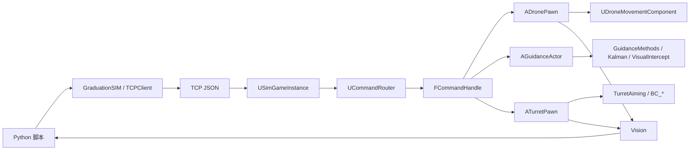

# 基于 Unreal Engine 5.7 的无人机拦截仿真平台

本项目是一个面向低空目标感知、目标跟踪、无人机拦截、转台火控、图像采集、数据集生成与实验复现的 UE5.7 + Python 联合仿真平台。

当前版本的代码主线已经统一到：

- UE 侧：`Source/GraduationProject`
- Python 侧：`PythonClient/Run/GraduationSIM` 与 `PythonClient/Run/*.py`
- 详细实现文档：`Document/项目实现流程与方法详解.md`

README 只负责说明项目结构、运行方式和模块边界；控制公式、预测模型、弹道链和详细方法解释请直接看 `Document/项目实现流程与方法详解.md`。

## 1. 项目定位

这个项目不是单一功能仓库，而是把以下能力串成一条闭环实验链：

1. 在 Unreal Engine 中构建可交互仿真场景。
2. 用 TCP + JSON 让 Python 远程创建/控制无人机、制导器和转台。
3. 在 UE 侧执行飞控、动力学、目标预测、视觉拦截和弹道解算。
4. 在 Python 侧完成实验编排、视觉检测、自动标注、训练和可视化。
5. 把图像、状态、控制和结果记录为可复现实验资产。

## 2. 当前架构总览



当前版本最重要的架构特点有三点：

- 不再依赖旧式专用命令处理器作为主路径，而是以 `add_actor / remove_actor / call_actor` 为统一远程调用入口。
- `AGuidanceActor` 是当前制导中心，统一承载火控制导、目标预测、自动拦截和视觉拦截。
- Python 主线已经切换到 `PythonClient/Run`，不应再按旧文档把 `PythonClient/gradsim` 当成现有主框架理解。

## 3. 顶层目录

```text
GraduationProject/
├── Config/                         UE 工程配置
├── Content/                        蓝图、地图、材质等 UE 资产
├── Document/                       项目文档、论文素材、开发记录
├── PythonClient/
│   ├── Run/                        当前 Python 主线脚本与 SDK
│   │   ├── GraduationSIM/          TCP 客户端与强类型封装
│   │   ├── run.py                  综合视觉拦截入口
│   │   ├── intercept_fixed_cam.py  固定相机实验入口
│   │   ├── Collect.py              自动采集与标注
│   │   └── Train.py                数据检查与 YOLO 训练
│   └── YOLO/                       数据集、训练结果、本地 ultralytics 源码
├── Source/GraduationProject/       UE C++ 源码
│   ├── Core/                       网络、路由、管理、时钟、记录器、控制器
│   ├── Drone/                      无人机本体、飞控与动力学
│   ├── Guidance/                   制导、预测、视觉拦截
│   ├── Turret/                     转台、弹丸与弹道计算
│   ├── Vision/                     图像采集与编码
│   └── UI/                         HUD 与画中画界面
├── GraduationProject.uproject      UE 工程入口
├── GraduationProject.sln           Visual Studio 解决方案
└── README.md
```

## 4. UE 侧模块说明

### 4.1 `Core`

- `Network`：`USimGameInstance`、`UCommandRouter`、`FCommandHandle`
- `Manager`：`UAgentManager`、`UCommandExecutionManager`
- `Simulation`：`USensorManager`、`USimClockService`、`USimulationRecorder`
- `Controller`：`UPDController`、`UPIDController`

这一层解决的是“怎么收命令、怎么路由、怎么管对象、怎么记数据”。

### 4.2 `Drone`

- `ADronePawn`：无人机 Actor 对外接口
- `UDroneMovementComponent`：级联控制、控制分配、刚体动力学、积分更新
- `UDroneApi`：高层动作包装
- `FDroneParameters / FDroneState`：参数与状态容器

这一层解决的是“无人机如何动起来”。

### 4.3 `Guidance`

- `AGuidanceActor`：当前所有制导逻辑的统一入口
- `GuidanceMethods`：直接瞄准、比例导航、预测制导等方法
- `UKalmanPredictor`：9 维常加速度预测器
- `UVisualInterceptController`：视觉状态机、Kalman、PID 与控制输出

这一层解决的是“如何算出要往哪飞、何时追、何时撞、何时开火”。

### 4.4 `Turret`

- `ATurretPawn`：转台实体与射击入口
- `UTurretAiming`：目标姿态与瞄准角解算
- `ABulletActor`：按预计算轨迹驱动飞行
- `BC_*`：弹道系数、阻力模型、积分器、输出量

这一层解决的是“如何算枪口指向与弹丸飞行”。

### 4.5 `Vision` 与 `UI`

- `CameraCaptureUtils`、`AirSimImageUtils`：图像采集、编码、JSON 打包
- `SimHUD`、`SimHUDPip`：HUD 信息、Agent 列表、画中画调试

这一层解决的是“如何看到结果、导出图像、调试链路”。

## 5. Python 侧主线说明

当前 Python 主线目录是 `PythonClient/Run`。

### 5.1 `GraduationSIM`

这是当前 Python SDK 层，负责把 TCP JSON 调用整理成可直接使用的类和数据结构。

- `TCPClient.py`：连接、收发、超时处理
- `AgentBase.py`：统一封装 `add_actor / remove_actor / call_actor`
- `AgentDrone.py`：无人机动作封装
- `AgentGuidance.py`：制导与视觉拦截动作封装
- `DataTypes.py`：位姿、图像包、标签与状态结果结构
- `__init__.py`：导出默认类名与公共接口

无人机默认蓝图类当前是：

`/Game/Blueprints/BP_Drone.BP_Drone_C`

### 5.2 运行脚本

- `run.py`：综合视觉拦截主入口
- `intercept_fixed_cam.py`：固定相机实验与框预测验证
- `Collect.py`：图像采集、自动标注、数据集写入
- `Train.py`：数据集检查、`data.yaml` 生成、YOLO 训练

### 5.3 数据与模型目录

- `PythonClient/YOLO/dataset`：训练/验证图片与标签
- `PythonClient/YOLO/runs/detect`：训练输出目录
- `PythonClient/YOLO/results`：训练摘要结果
- `PythonClient/YOLO/ultralytics`：本地 Ultralytics 源码

## 6. 当前端到端流程

### 6.1 视觉拦截链

`启动 UE -> Python 连接 -> 创建拦截机/目标机/制导器 -> 起飞 -> 获取图像 -> YOLO 检测 -> VisualInterceptUpdate -> UE 计算控制量 -> 无人机执行 -> 返回新图像与状态`

### 6.2 自动标注链

`启动 UE -> 创建采集机与目标 -> 相机采图 -> 读取目标姿态 -> 几何投影到图像平面 -> 生成 YOLO 标签 -> 写入 dataset`

### 6.3 训练链

`Collect.py 生成数据 -> Train.py 修复并统计 -> 调用本地 ultralytics -> 输出 best.pt -> run.py / intercept_fixed_cam.py 加载推理`

## 7. 环境要求

建议环境如下：

- Unreal Engine `5.7`
- Visual Studio C++ 开发工具链
- Python `3.10+`
- OpenCV Python 包
- 能运行 Ultralytics / PyTorch 的本地 Python 环境

说明：

- 项目已经内置 `PythonClient/YOLO/ultralytics` 源码目录，因此训练脚本不是依赖全局 pip 版 ultralytics 才能工作。
- 如果只做 UE 仿真与控制，不训练模型，则主要保证 Python 能运行 `cv2` 和 TCP 客户端即可。

## 8. 构建与启动

### 8.1 UE 工程构建

常见方式有两种。

第一种：直接用 UE5.7 打开 `GraduationProject.uproject`，按提示生成并编译。

第二种：使用 UE 的 `Build.bat` 直接构建，例如：

```powershell
<UE_5.7>\Engine\Build\BatchFiles\Build.bat GraduationProjectEditor Win64 Development -Project="D:\Xstarlab\UEProjects\GraduationProject\GraduationProject\GraduationProject.uproject" -WaitMutex -FromMsBuild -architecture=x64
```

构建完成后，UE 会加载 `GraduationProject` 模块，`USimGameInstance` 在运行时启动 TCP 服务端。

### 8.2 启动顺序

推荐启动顺序：

1. 打开 UE 工程并进入可运行场景。
2. 确认仿真启动后 TCP 服务端正常监听 `127.0.0.1:9000`。
3. 在 `PythonClient/Run` 目录下运行所需脚本。
4. 观察 UE 场景、OpenCV 窗口和输出目录中的结果。

## 9. 常用运行入口

在项目根目录下，进入 `PythonClient/Run` 后执行：

```powershell
cd PythonClient\Run
python run.py
```

固定相机实验：

```powershell
cd PythonClient\Run
python intercept_fixed_cam.py
```

数据采集：

```powershell
cd PythonClient\Run
python Collect.py
```

模型训练：

```powershell
cd PythonClient\Run
python Train.py
```

## 10. 主要输出位置

- `Saved/SimRecords`：仿真记录输出
- `PythonClient/YOLO/dataset`：采集得到的数据集
- `PythonClient/YOLO/runs/detect`：训练过程输出
- `PythonClient/YOLO/results`：训练摘要 JSON
- 脚本默认加载的模型权重路径通常位于 `PythonClient/YOLO/runs/detect/.../weights/best.pt`

## 11. 当前版本需要注意的点

- 不要再按旧文档把 `PythonClient/gradsim` 当作当前主入口理解。
- 当前远程调用主路径是 `call_actor` 反射调用，不是旧式专用 handler 体系。
- 四旋翼控制分配矩阵和视觉拦截参数应以现代码为准，不要混用历史文档中的符号和参数名。
- 自动标注依赖相机几何和目标姿态，出现训练问题时先查标签质量，再查模型本身。

## 12. 文档索引

- 总体实现流程、代码归拢、公式链、构建链：`Document/项目实现流程与方法详解.md`
- 视觉拦截开发记录：`Document/视觉拦截_开发进度.md`
- 其他论文与文档素材：`Document/`

## 13. 一句话概括

本项目的核心不是“单个算法文件”，而是把 UE 场景、远程控制、四旋翼飞控、目标预测、视觉拦截、转台弹道、自动标注和 YOLO 训练真正装配成了一条可运行、可复现、可扩展的实验链。
