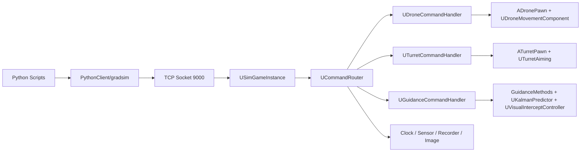

# 基于 Unreal Engine 5.7 的无人机拦截仿真平台

本项目用于毕业设计与算法验证，当前主线目标是构建一个可复现实验平台，完成以下闭环：

- 控制闭环：Python 下发命令，UE 执行并回传状态。
- 感知闭环：UE 输出图像，Python 获取图像并驱动可视化或检测流程。
- 拦截闭环：目标机轨迹生成，C++ 制导解算，拦截机持续追踪。

## 1. 当前架构



## 2. 当前有效目录

```text
GraduationProject/
├── Config/
├── Content/
├── Document/
├── PythonClient/
│   ├── gradsim/                     # 复用型 TCP 客户端库
│   ├── Drone/
│   │   ├── auto_spawn_visual_intercept.py
│   │   └── README.md
│   ├── Turret/
│   │   ├── auto_spawn_visual_intercept.py   # 兼容包装入口
│   │   └── README.md
│   ├── YOLO/                        # 第三方和训练资产，本仓库默认忽略
│   └── README.md
├── Source/GraduationProject/
│   ├── Core/
│   ├── Drone/
│   ├── Guidance/
│   ├── Turret/
│   ├── Vision/
│   └── UI/
├── GraduationProject.uproject
└── README.md
```

## 3. Python 侧主入口

- 主脚本：`PythonClient/Drone/auto_spawn_visual_intercept.py`
- 兼容入口：`PythonClient/Turret/auto_spawn_visual_intercept.py`
- 通用客户端库：`PythonClient/gradsim/client.py`

当前推荐只围绕 `PythonClient/gradsim` 和 `PythonClient/Drone` 做新开发，`PythonClient/Turret` 仅保留兼容入口，避免旧命令失效。

## 4. 通信协议概览

### 4.1 通用消息

- `add_actor`：动态生成智能体。
- `remove_actor`：移除智能体。
- `call_actor`：对指定 Actor 调用通用函数。

### 4.2 业务命令

- 系统：`ping`、`sim_pause`、`sim_resume`、`sim_reset`、`sim_step`
- 无人机：`call_drone`、`get_drone_state`
- 转台：`call_turret`、`get_turret_state`
- 制导：`call_guidance`、`get_guidance_state`
- 图像：`get_image`

### 4.3 当前 Python 封装

`PythonClient/gradsim/client.py` 已对当前主流程封装了以下常用接口：

- Actor 管理：`add_actor`、`remove_actor`、`call_actor`
- 无人机：`drone_takeoff`、`drone_hover`、`drone_move_to`、`drone_move_by_velocity`、`drone_state`
- 转台：`turret_set_angles`、`turret_fire`、`turret_start_tracking`、`turret_state`
- 制导：`guidance_reset`、`guidance_auto_intercept`、`guidance_state`
- 图像：`get_image_raw`、`get_image_numpy`

## 5. 当前拦截流程

`PythonClient/Drone/auto_spawn_visual_intercept.py` 的流程如下：

1. 通过 `add_actor` 生成拦截机和目标机。
2. 等待两机起飞至设定高度。
3. 目标机按照稳定轨迹参考飞行。
4. 每个控制周期调用一次 C++ `auto_intercept`。
5. 可选拉取拦截机图像，在独立窗口显示瞄准和距离信息。
6. 捕获、超时或人工退出后执行清理。

该脚本当前保持“单 TCP 连接串行发送”的策略，避免目标控制和拦截控制的响应在同一连接上交错。

## 6. 运行方式

### 6.1 UE 端

1. 打开 `GraduationProject.uproject`。
2. 编译 `GraduationProjectEditor Win64 Development`。
3. 进入 PIE，确认 TCP 服务监听 `127.0.0.1:9000`。

构建示例：

```powershell
& 'D:\Epic Games\UE_5.7\Engine\Build\BatchFiles\Build.bat' \
  GraduationProjectEditor Win64 Development \
  -Project='D:\Xstarlab\UEProjects\GraduationProject\GraduationProject\GraduationProject.uproject' \
  -WaitMutex -FromMsBuild -architecture=x64
```

### 6.2 Python 端

主入口：

```bash
python PythonClient/Drone/auto_spawn_visual_intercept.py --show
```

兼容入口：

```bash
python PythonClient/Turret/auto_spawn_visual_intercept.py --show
```

## 7. 常见问题

- 无法连接：确认 UE 已进入 PIE，且端口 `9000` 已监听。
- 看不到图像窗口：检查 `opencv-python` 是否已安装。
- `add_actor` 失败：先确认 Blueprint 路径与当前工程资源一致，再检查 UE 返回 JSON 是否完整。
- 目标机不稳定：优先检查目标速度、转弯角速度、单位换算是否一致。

## 8. 文档入口

- 详细实现说明：[Document/项目实现流程与方法详解.md](Document/项目实现流程与方法详解.md)
- 结构整理说明：`Document/代码结构与文件整理优化方案_审阅版.md`
- 视觉拦截进度：`Document/视觉拦截_开发进度.md`

## 9. 当前工作区说明

当前仓库为进行中工作区，存在较多未提交改动。阅读代码时，优先以 `PythonClient/gradsim`、`PythonClient/Drone` 和 `Source/GraduationProject` 中的当前实现为准，不以旧脚本名称或历史目录说明为准。